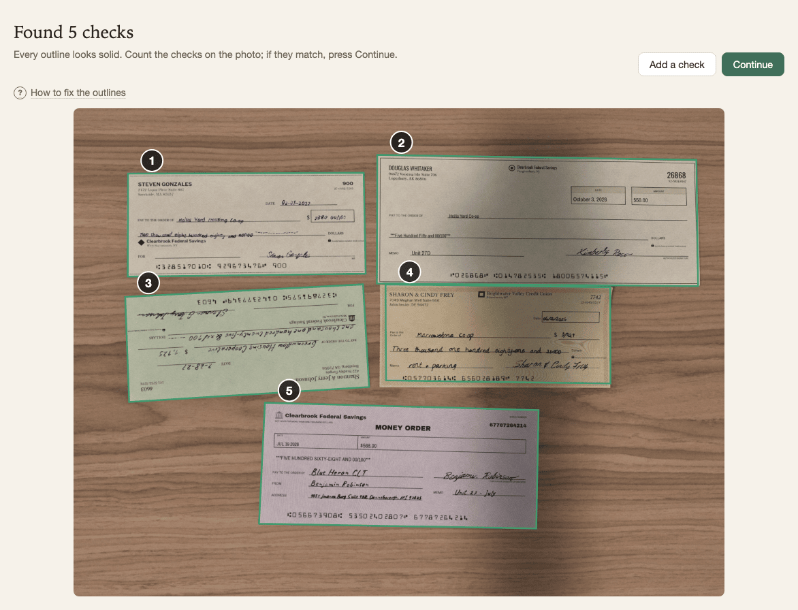
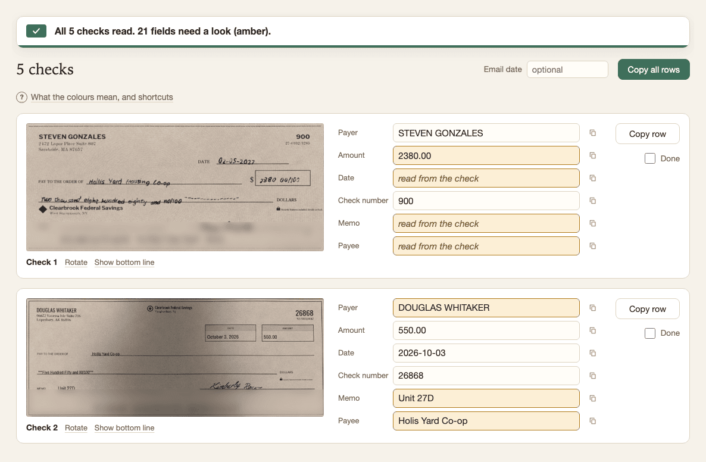

# Check Transcriber

Paste a phone photo of several checks and get each check straightened, its fields read, and rows ready to paste into your spreadsheet, without the photo ever leaving your computer.

<p align="center">
  <a href="https://maninae.github.io/check-transcriber/"></a>
</p>

<p align="center"><b><a href="https://maninae.github.io/check-transcriber/">Open Check Transcriber</a></b></p>

---

## Get started in a minute

1. **Open** [maninae.github.io/check-transcriber](https://maninae.github.io/check-transcriber/) in Chrome or Edge. Nothing to install, no account.
2. **Bring in the photo**, any of three ways:
   - **Paste**: in Gmail, click the attachment to open the preview, right-click the image, choose **Copy image**, switch to the Check Transcriber tab, and press <kbd>Ctrl</kbd>+<kbd>V</kbd> anywhere on the page.
   - **Drag** the attachment (or a file from your computer) anywhere onto the page.
   - **Click** the drop area to browse for the file.
3. **Check the outlines.** Each check found gets a numbered outline. Count them against the photo; drag a corner to fix one, or use **Add a check** for one it missed.
4. **Press Continue.** One row per check appears, with the straightened check on the left and its fields on the right.
5. **Read down the grid.** Plain fields were read confidently, amber ones need a look, and empty amber ones are yours to type from the picture beside them.
6. **Copy** a field, a row, or **Copy all rows**, and paste into your spreadsheet. Each field lands in its own cell.
7. **Finish batch** when you are done. The page clears the photo and is ready for the next one.

> [!TIP]
> After the first visit the page keeps its own files, so it opens and works with no internet connection.

---

## What it does

- **Finds every check** in the photo, even at an angle or upside down, and straightens each one into a flat, upright picture.
- **Reads the printed fields**: payer, check number, date, amount, memo and payee.
- **Fills the amount only when two readings agree**: the number in the box and the amount written out in words. Otherwise it leaves the field amber for you.
- **Leaves handwriting blank** next to the picture of the check, so you read it yourself. An optional handwriting reader (a one-time download in Settings) can fill those in too.
- **Puts everything on one scrolling page**, with a copy button on every field and row, in the column order you pick in Settings.
- **Remembers payer names** to suggest spellings, and warns you when a check with the same number and payer was in an earlier batch.

---

## Your photos stay on your computer

There is no server: the page is a set of files your browser downloads once, and every step runs on your own machine. Nothing is uploaded, and after the first load the browser's network tab stays silent while you work. The bank-number line along the bottom of each check is blurred in every picture the page shows, and the page never reads it.

<p align="center">
  
</p>

---

## For the curious

The repo has three parts:

- **[`app/`](app/CLAUDE.md)**: the page itself, plain HTML, CSS and JavaScript with no build step, served from GitHub Pages. A small on-device detector finds the checks and on-device readers read the fields.
- **The synthetic-data packages**: real checks carry bank numbers, so every training and test photo is invented. [`synthetic_checks`](synthetic_checks/README.md) draws one fake check, [`synthetic_backgrounds`](synthetic_backgrounds/README.md) supplies the surfaces, [`scene_composer`](scene_composer/README.md) lays checks out as a phone photo, and [`dataset_builder`](dataset_builder/README.md) builds fixed held-out sets.
- **[`experiments/`](experiments/README.md)**: training and evaluation for the [check detector](experiments/detection/README.md) and the [field readers](experiments/field_reading/README.md), with their results.

Run the page locally:

```bash
cd app
python3 -m http.server 8000   # then open http://localhost:8000/
```

Run the tests (the browser tests need Playwright with Chromium installed; the Python packages need the venv described in [`CLAUDE.md`](CLAUDE.md)):

```bash
python3 app/tests/test_smoke.py   # the page, end to end in a real browser
python -m pytest                  # the synthetic-data packages, from the repo root
```

The full browser test list is in [`app/CLAUDE.md`](app/CLAUDE.md#testing). The product spec is [`docs/SPEC.md`](docs/SPEC.md), and the latest usability review is [`docs/UX_AUDIT.md`](docs/UX_AUDIT.md).

---

## License

[MIT](LICENSE), covering the app, the synthetic-data packages, the experiments, and the models trained in this repo. Two third-party exceptions:

- **YOLO experiments** under `experiments/detection/` were trained with Ultralytics (AGPL-3.0). Those weights are a research reference only and are not part of the app.
- **The optional handwriting reader** is Microsoft's `trocr-small-handwritten`. Its code is MIT, but its model card states no licence for the weights, and they were fine-tuned on the IAM dataset, whose terms are non-commercial research only. That is why the app offers it as a separate opt-in download rather than bundling it.
