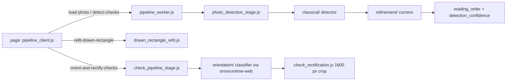

# js/pipeline/ — the pixel work, in a Web Worker

Everything that touches photo pixels runs here, off the main thread (spec section 5). The page talks to it only through `pipeline_client.js`; no OpenCV object ever crosses to the main thread.

## Modules

| File | Owns |
|---|---|
| `pipeline_worker.js` | Classic worker entry: `importScripts` OpenCV.js + onnxruntime-web, dynamic-imports `worker_stages.js`, holds the current photo (BGR Mat + 1280 px orientation gray), message dispatch. |
| `pipeline_client.js` | Main-thread side: blob bootstrap, request ids, Promises, progress and per-check streaming callbacks. |
| `worker_stages.js` | The one ES module the worker imports; re-exports every stage entry point. |
| `photo_detection_stage.js` | classical → refinement → reading order → confident cue. |
| `drawn_rectangle_refit.js` | "Add a check": detect in a padded crop around the drag, else refine the drag, else keep it. |
| `check_pipeline_stage.js` | Per confirmed quad: orientation then rectification. |
| `check_rectification.js` | Perspective warp to the upright 1600 px landscape crop (height from the quad's aspect). |
| `orientation/` | Port of `experiments/detection/orientation/` (1280 px gray, 224x96 crop, roll rules) and the ONNX session. |
| `classical/` | Port of `experiments/detection/classical/`; see its CLAUDE.md. |
| `refinement/` | Port of `experiments/detection/refinement/`; see its CLAUDE.md. |
| `reading_order.js`, `detection_confidence.js`, `quadrilateral_math.js` | Pure JS (no OpenCV), also used by the count step on the main thread. |

## Invariants

- **Every stage takes `cv` (and `ort`) as arguments**, touches no globals, DOM or worker APIs, and is synchronous around OpenCV. The same files run in Node for Python parity (`app/tests/parity/`) and in the worker.
- **Never await, return, or resolve a Promise with `cv`.** It is Emscripten's module object and has its own `.then`, so a Promise adopting it never settles (the milestone-1 page hang). Only `self.cv.then(callback)`. onnxruntime-web's Promises are native and safe.
- **The worker must be started from the blob bootstrap in `pipeline_client.js`.** A blob worker inherits the page's CSP; a worker loaded from its own URL gets its CSP from HTTP headers, and GitHub Pages sends none (verified: the URL-loaded worker could fetch any origin). Inside the worker, resolve relative paths against `self.PIPELINE_WORKER_URL`.
- **Top-level names in `pipeline_worker.js` must not be `cv` or `ort`.** A classic worker's top-level `let` is a global lexical binding; `ort.wasm.min.js` starts with `var ort=`, and the clash makes `importScripts` fail with a misleading NetworkError.
- **Delete every `cv.Mat`** (try/finally). The photo's Mats are freed on `release-photo` (Finish batch, Start over, next photo).
- **Faithful ports.** `classical/`, `refinement/` and `orientation/` reproduce the Python bit-for-bit where it matters (numpy rounding, float32 steps, numpy's PCG64 for RANSAC). Change the Python first, then re-run the parity scripts; never "improve" the JS alone.

## Parity and regression

- Node, cv2 pixels, per module: `app/tests/parity/` (`run_refinement_parity.mjs`, `run_classical_parity.mjs`, `dump_*.py`).
- Browser, end to end on eval scenes: `app/tests/test_detection_regression.py`.
