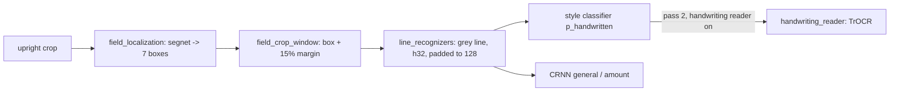

# js/pipeline/fields/ — reading the fields of an upright check (spec section 5, stages 5-6)

Runs in the pipeline worker. Input: an upright RGBA crop, 1600 px wide (from `check_rectification.js`). Output per field: `{ text, confidence, handwrittenProbability, reader, box } | null`, the input of `js/fields/field_gating.js`. The MICR band has no segnet channel, so it is never located, cropped or read.

| Module | Owns |
|---|---|
| `field_reading_config.js` | Model paths, charsets, every constant mirrored from `experiments/field_reading/`. |
| `field_model_sessions.js` | Opens the four default models (fp32; int8 moves CRNN confidences and breaks the gate). |
| `field_localization.js` | Segnet canvas (half-size INTER_AREA + the research's crop->canvas homography) and `segnet_postprocess` (sigmoid, upsample, components, largest mass, val gate 0.8). |
| `field_crop_window.js` | `data_access/field_crop.py`'s margin rule. |
| `line_recognizers.js` | CRNN + style classifier on the grey line; both right-pad to 128 px like training. |
| `ctc_decoding.js` | Greedy CTC, `mean_char` confidence (the kind the thresholds were tuned on). |
| `handwriting_reader.js` | Opt-in TrOCR (Xenova fp32 encoder + int8 merged decoder) on the worker's own onnxruntime-web; download with progress; greedy merged-past-KV decode. |
| `pillow_image_operations.js` | Bit-exact Pillow RGB->L, autocontrast, bicubic resize (TrOCR's input recipe). |
| `check_field_reading.js` | Pass 1 `readCheckFields` (default readers, every field) and pass 2 `readHandwrittenFields` (TrOCR over pass 1's handwritten fields). |

## Invariants and gotchas
- **Faithful ports, measured.** `app/tests/test_field_reading_regression.py` feeds eval crops to this code in Chromium and to `app/tests/field_reading/python_field_reader.py` (the same steps on the research code): boxes, texts and readers must be identical, confidences within 1e-3.
- **Lines are right-padded to a multiple of 128 px** before the CRNN (valid timesteps decoded only). The CRNN is a BiLSTM trained on 128-px-padded batches; unpadded reads lost 3.4 points overall on 300 eval crops.
- **INTER_LINEAR_EXACT, not INTER_LINEAR**, for the line resize: cv2 on the ARM Mac the models were trained on routes INTER_LINEAR through a vendor HAL no browser reproduces; LINEAR_EXACT is bit-identical in OpenCV.js and cv2.
- **Fresh session-options object per `InferenceSession.create`**: onnxruntime-web writes `extra` into it; a shared or frozen object makes engine start fail.
- **TrOCR int8 decoder differs slightly between native and WASM onnxruntime** (quantized kernels): low-confidence reads can flip. With Xenova's fp32 decoder both sides match exactly (54/54), which is how the decode loop port was proved.
- Never resolve or return `cv` from a Promise (see `../CLAUDE.md`); these modules use OpenCV synchronously around onnxruntime's native Promises.
