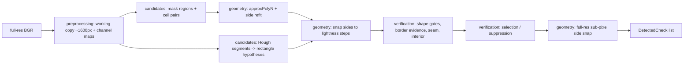

# classical/: the no-model check detector (OpenCV only)

Finds every paper check in a phone photo and returns clockwise full-resolution quads (`DetectedCheck`, `orientation_known=False`). It is the app's milestone-2 detector and will be ported to OpenCV.js, so every operation must exist in OpenCV.js core/imgproc (no contrib, no scikit-image; numpy here stands in for Mat arithmetic and small loops). Checked against `platforms/js/opencv_js.config.py`: `approxPolyN`, `fitLine`, `HoughLinesP`, `remap`, `sqrBoxFilter`, `connectedComponentsWithStats`, `intersectConvexConvex` are all exported. LSD's `detect` is not, so it is not used.

## Pipeline



## Module map

| Path | Responsibility |
|------|----------------|
| `classical_detector_config.py` | Every threshold (one dataclass). Scale-dependent sizes are fractions of the working long side. |
| `detect_checks_classical.py` | Top-level `detect_checks_classical(image_bgr, config)`; wires the stages, cheapest gates first. |
| `preprocessing/working_image_channels.py` | Resize; text-suppressed lightness, chroma, Lab a/b, paper score, print residue, texture std, gradients. |
| `candidates/candidate_regions.py` | Mask families (smooth, textured, paper-score Otsu, gradient / Canny edge cells, hole-filled Canny) and their regions. |
| `candidates/adjacent_cell_merging.py` | Unions of neighbouring edge cells (a check cut by a shadow edge or fold). |
| `candidates/line_segment_extraction.py` | Canny + HoughLinesP + collinear merge, texture-suppressed. |
| `candidates/line_quadrilateral_hypotheses.py` | Parallel segment pairs + perpendicular end caps -> rectangles. Budgeted (tartan/gingham). |
| `geometry/quadrilateral_geometry.py` | Pure helpers: ordering, aspect, IoU, line intersection. |
| `geometry/quadrilateral_fitting.py` | Region contour -> quad (approxPolyN, Huber side refit), coarse pre-gates. |
| `geometry/edge_line_snapping.py` | Snap each side to the strongest nearby step (profiles via remap, sub-pixel, fitLine). |
| `geometry/full_resolution_edge_refinement.py` | Final snap on the original image. |
| `verification/quadrilateral_verification.py` | Shape gates; per-side border support from gradient OR color OR texture contrast. |
| `verification/interior_appearance.py` | Interior must look like printed paper (print fraction, smooth, bright, neutral). |
| `verification/interior_seam_detection.py` | Rejects quads with another check's border crossing the interior. |
| `verification/candidate_selection.py` | Greedy NMS: duplicate IoU, containment, union coverage, relative-area fragment floor. |
| `run_classical_detector.py` | CLI over a split; writes predictions JSON with `seconds_per_image`. |
| `tune_classical_detector.py` | Coordinate sweep on a val slice; writes `best_config.json`. |
| `render_debug_overlays.py` | GT (green) vs predictions (red) overlays for reading by eye. |

## Invariants

- Output corners are full-resolution, clockwise in image coordinates, pixel-center convention (`(x + 0.5) * scale - 0.5` when scaling up).
- A quad side lying on the image border counts as supported (out-of-frame checks) and such quads get a looser aspect gate.
- Candidate generators are generous; precision comes from verification + selection. A new generator only needs to emit `FittedQuadrilateral`s into `collect_verified_candidates`.
- Any per-image work that can grow combinatorially must be budgeted (see line hypotheses).
- Tune on val only (`--offset` slices keep dev and tuning subsets apart); eval is scored once with the frozen config.
- Outputs go to `/Volumes/vega/datasets/check-transcriber/experiments/detection/classical/`, never the internal disk. Keep process pools at 2 workers on the shared 16 GB machine.

## Commands

```
python -m experiments.detection.classical.run_classical_detector \
    --split val --workers 2 --config-json <best_config.json> \
    --output <vega>/classical/<run>/predictions.json --score
python -m experiments.detection.metrics.score_predictions \
    --predictions <predictions.json> --split val --output-dir <dir>
python -m pytest experiments/detection/tests/test_classical_*.py
```
