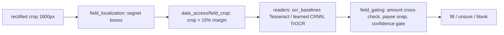

# field_reading — locate and read check fields on a rectified crop

Input: a rectified, upright check crop 1600 px wide (the detection owner's output). Output per field: text + confidence, or blank. Fields: payer_name, payee, amount_numeric (courtesy box), amount_words (legal line), date, memo, check_number. MICR is never read (spec section 7).

## Pipeline (mirrors spec section 5, stages 5-7)

## Directories
| dir | owns |
|---|---|
| `config.py` | paths (all data/models on vega), `CheckField` enum |
| `data_access/` | manifest loading + canonical join (`field_manifest`), train re-cut matching synth's rectification (`train_crop_export`), the one field-crop margin rule (`field_crop`) |
| `field_localization/` | layout priors + ink refinement, segnet localizer; own CLAUDE.md |
| `ocr_baselines/` | Tesseract (tesserocr = same engine/data as the app's Tesseract.js), config search, field text cleanup, real-set scorers |
| `learned/` | CRNN-CTC and TrOCR readers, routers, ONNX export; own CLAUDE.md, MODEL_LICENCES.md |
| `field_gating/` | stage-7 logic: amount numeric/words agreement, payee snap to a known list |
| `metrics/` | the single definition of a correct read (`field_value_parsing`), CER/WER, gating curves, hard-set slices, per-run reports, `final_comparison`; own CLAUDE.md |
| `gallery/` | contact sheets for humans |
| `tests/` | pytest, `test_<area>_*.py` |

## Invariants
- Predictions follow the contract in PLAN.md (`predictions/<split>/<method>__loc=<localization>.jsonl`); every method is scored by `metrics/`, never by its own code.
- `metrics/` scores raw predictions and never imports reader-side cleanup.
- Model selection on val; eval scored once per final method. Handwriting conclusions are judged on REAL crops (SSBI 78 hand-labelled, ORAND-CAR courtesy amounts; both non-commercial, eval only, never copied off vega). Synth handwriting numbers are font recall.
- One heavy MPS job at a time across the area (`logs/MPS_LOCK`), at most 2 worker processes; the Mac is shared with the detector owner.
- Run everything from the worktree root: `python -m experiments.field_reading.<dir>.<module>` with the venv at `/Volumes/vega/datasets/check-transcriber/venv/`.
